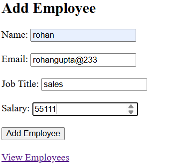
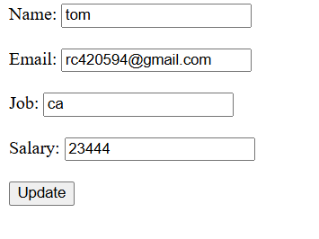
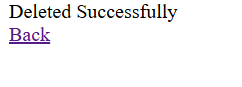
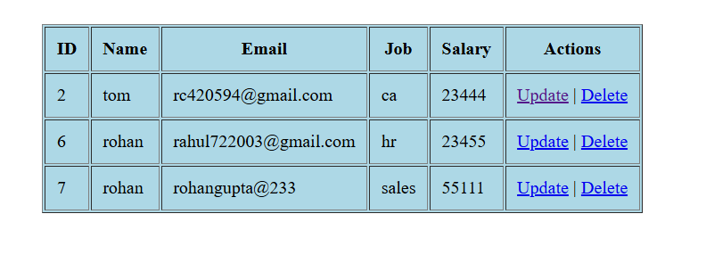

# 📌 Homework No 2.

## 📖 Overview

The **Employee Management System** is a simple web-based application developed using **PHP and MySQL**.
It allows users to manage employee records efficiently by performing basic CRUD (Create, Read, Update, Delete) operations.

This project is beginner-friendly and helps in understanding how backend and database integration works in real-world applications.

---

## 📂 Folder Structure

employee_db/
│── db.php                 # Database connection
│── index.php              # Add employee form
│── insert.php             # Insert data into database
│── display.php            # Display all employees
│── update.php             # Edit employee form
│── update_process.php     # Update employee data
│── delete.php             # Delete employee
│── README.md              # Project documentation

---

## 🚀 Main Features

✔ Add new employee details
✔ View all employee records in table format
✔ Update existing employee information
✔ Delete employee records
✔ Simple and user-friendly interface
✔ Lightweight and fast performance

---

## ⚙️ How to Run the Project
1. Copy the project folder to:
   C:\xampp\htdocs\

2. Open **phpMyAdmin** and create a database:
   employee_db

2. Run the following SQL query:

   CREATE TABLE employees (
   id INT AUTO_INCREMENT PRIMARY KEY,
   name VARCHAR(100),
   email VARCHAR(100),
   job_title VARCHAR(100),
   salary INT
   );

6. Open your browser and run:
   http://localhost/employee_db/

---

## 🛠️ Technologies Used

* PHP
* MySQL
* HTML
* XAMPP

---

## 📸 Screenshots
### Q1-Q3
* INSERT
- 

* UPDATE
- 

* DELETE
- 

* DISPLAY
- 

### Q4
* Insert
- 

* Display
- 

## 👨‍💻 Author

Rahul Chaurasiya
